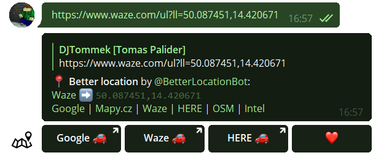

# BetterLocation

Simple but very smart Telegram bot for processing various types of location format and converting them to user-defined formats. 
Available publicly on [@BetterLocationBot](https://t.me/BetterLocationBot).

## Requirements
- PHP webserver (written and tested with PHP 7.3)
- Database server (written and tested with MySQL 8 and MariaDB 10)
- Domain with SSL certificate (might be self-signed). Detailed requirements are described on [Telegram's webhook page](https://core.telegram.org/bots/webhooks).

## Installation
1. Download/clone [BetterLocation repository](https://github.com/DJTommek/better-location).
1. Install production dependencies via `composer install --no-dev` - you need [Composer](https://getcomposer.org/) to do that.
1. Update all `DB_*` and `TELEGRAM_*` constants in `data/config.local.php`.
1. Create database using [structure.sql](asset/sql/structure.sql) script.
1. **Optional**: In case you are not doing this installation directly on your (web)hosting, copy all files there now.
1. Register [bot webhook](https://core.telegram.org/bots/api#setwebhook) to your webserver via [set-webhook.php](www/admin/set-webhook.php). For detailed info, open [index.php](www/admin/index.php).

## Development and testing
1. Install development depenencies via `composer install --dev`.
1. Run [PHPStan](https://phpstan.org/) static analysis via `composer phpstan`.
1. Run [PHPUnit](https://phpunit.de/) tests via `composer test`.

Note: Some tests may be skipped if missing configuration (Glympse or What3Words)

## Deep linking

This bot is supporting Telegram's [deep linking](https://core.telegram.org/bots#deep-linking) using `?start=parameter` or `?startgroup=parameter` so you can create links from your website or app to directly perform one of actions listed below (currently only [Show location](#show-location)).

Parameter `start` will open in user's private message and create "start" button.  
Parameter `startgroup` works similarly, but user will be prompted to select group, where @BetterLocationBot will be added.

### Show location
Show location as better message.  
Because Telegram is very restrictive what can be in start parameter, WGS-84 coordinates are encoded as two parts (lat_lon) with `_` as divider. To encode coordinate, multiply coordinate by 1 000 000 and round to integer.

| Input coordinates | Encoded coordinates | Result link |
|-------------------|---------------------|-------------|
| `50.733088,15.741169` |  `50733088_15741169` | [https://t.me/BetterLocationBot?start=50733088_15741169](https://t.me/BetterLocationBot?start=50733088_15741169) |
|  `-14.7653,4.845524` |  `-14765300_4845524` | [https://t.me/BetterLocationBot?start=-14765300_4845524](https://t.me/BetterLocationBot?start=-14765300_4845524) |
| `-41.326919711111,174.80770311111` | `-41326919_174807703` | [https://t.me/BetterLocationBot?start=-41326919_174807703](https://t.me/BetterLocationBot?start=-41326919_174807703) |

### Internal
There are some internal usages of start parameters as add to favourite, but it is not recommended to use it from external applications, since it might change any time. 
For encoding and decoding parameters are used `InlineTextDecode()`, `InlineTextEncode()`, `generateStart()` and `generateStartCoords()` methods from [\App\TelegramCustomWrapper\TelegramHelper](src/libs/TelegramCustomWrapper/TelegramHelper.php) namespace.  

---
*Based on the simple [DJTommek/php-template](https://github.com/DJTommek/php-template).*
