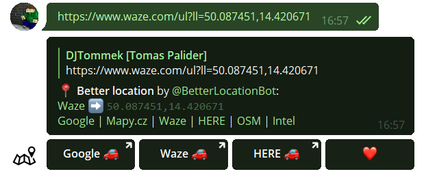

# BetterLocation

Simple but very smart Telegram bot for processing various types of location format and converting them to user-defined formats. 
Available publicly on [@BetterLocationBot](https://t.me/BetterLocationBot).

## Requirements
- PHP webserver (written and tested with PHP 7.3)
- Database server (written and tested with MySQL 8 and MariaDB 10)
- Domain with SSL certificate (might be self-signed). Detailed requirements are described [here](https://core.telegram.org/bots/webhooks).

## ⚠ Important note
MapyCZ link with a Place ID or Panorama ID is currently **NOT** working properly without an additional NodeJS server. Read [this page](src/nodejs/README.md) for more info.  

## Installation
1. Download/clone [BetterLocation repository](https://github.com/DJTommek/better-location).
1. Run `composer install`.
1. Update all `DB_*` and `TELEGRAM_*` constants in `data/config.local.php`.
1. Create database using [structure.sql](asset/sql/structure.sql) script.
1. **Optional**: In case you are not doing this installation directly on your (web)hosting, copy all files there now.
1. Register [bot webhook](https://core.telegram.org/bots/api#setwebhook) to your webserver via [set-webhook.php](./set-webhook.php). For detailed info, open [index.php](./index.php).
1. **Optional but recommended**: Disable public access to all files except webhook.php, which has to be accessed from Telegram servers.

## Testing
1. Run `composer test` (or directly `./vendor/bin/phpunit tests`).

Note: Some tests may be skipped if missing configuration (eg. What3Words or MapyCZ Place ID and Panorama ID)

---
*Based on the simple [DJTommek/php-template](https://github.com/DJTommek/php-template).*
