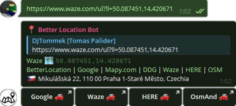
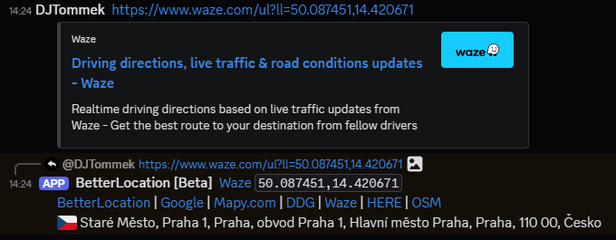

# [BetterLocation]([https://github.com/DJTommek/better-location])

Simple but very smart Telegram and Discord bot for processing various types of location format and converting them to user-defined formats.

Available publicly on:
- Web [better-location.palider.cz](https://better-location.palider.cz/).
- Telegram as [@BetterLocationBot](https://t.me/BetterLocationBot)
- Discord as [BetterLocation#0881](https://discord.com/oauth2/authorize?client_id=1391122758523551744&permissions=67584&integration_type=0&scope=bot)

 

 

## Requirements

### Website and Telegram bot

- PHP webserver (written and tested with PHP 8.2)
- Database server (written and tested with MariaDB 10)
- Domain with SSL certificate (might be self-signed). Detailed requirements are described on [Telegram's webhook page](https://core.telegram.org/bots/webhooks).

### Discord bot

- PHP (written and tested with PHP 8.2)

## Installation

1. Download/clone [BetterLocation repository](https://github.com/DJTommek/better-location).
2. Install production dependencies via `composer install --no-dev` - you need [Composer](https://getcomposer.org/) to do that.
3. To setup website and Telegram:
   1. Update `APP_URL` and all `DB_*` and `TELEGRAM_*` constants in `data/config.local.php`.
   2. Create database using [structure.sql](asset/sql/structure.sql) script.
   3. **Optional**: In case you are not doing this installation directly on your (web)hosting, copy all files there now.
   4. Follow instructions on [/admin/index.php](www/admin/index.php).
4. To setup Discord bot:
   1. Update `DISCORD_*` constants in `data/config.local.php`.
   2. Start discord bot by executing [/src/discord.cli.php](/src/discord.cli.php) file in PHP in command line (eg `php /src/discord.cli.php`) as long-running process.

## Development and testing

Install development depenencies via `composer install --dev`.

### Code quality

Run [PHPStan](https://phpstan.org/) static analysis via `composer phpstan`.

Baseline can be re-generated via composer `phpstan-baseline`

### Tests

Run [PHPUnit](https://phpunit.de/) tests via `composer test` which will run all tests available. For running only tests, that are very quick (great for precommit hook), run `composer test-quick`.

#### Notes

- All tests, that are doing **ANY** request to external service must be labeled as `@group request` (more in [PHPUnit docs](https://phpunit.readthedocs.io/en/stable/annotations.html#group))
- Some tests may be skipped if missing configuration (Glympse, What3Words, ...)

## Telegram Deep linking

This bot is supporting Telegram's [deep linking](https://core.telegram.org/bots#deep-linking) using `?start=parameter` or `?startgroup=parameter` so you can create links from your website or app to directly perform one of actions listed below (currently only [Show location](#show-location)).

Parameter `start` will open in user's private message and create "start" button. 
Parameter `startgroup` works similarly, but user will be prompted to select group, where @BetterLocationBot will be added.

### Show location

Show location as better message. 
Because Telegram is very restrictive what can be in start parameter, WGS-84 coordinates are encoded as two parts (lat_lon) with `_` as divider. To encode coordinate, multiply coordinate by 1 000 000 and round to integer.

| Input coordinates                  | Encoded coordinates   | Result link                                                                                                          |
|------------------------------------|-----------------------|----------------------------------------------------------------------------------------------------------------------|
| `50.733088,15.741169`              | `50733088_15741169`   | [https://t.me/BetterLocationBot?start=50733088_15741169](https://t.me/BetterLocationBot?start=50733088_15741169)     |
| `-14.7653,4.845524`                | `-14765300_4845524`   | [https://t.me/BetterLocationBot?start=-14765300_4845524](https://t.me/BetterLocationBot?start=-14765300_4845524)     |
| `-41.326919711111,174.80770311111` | `-41326919_174807703` | [https://t.me/BetterLocationBot?start=-41326919_174807703](https://t.me/BetterLocationBot?start=-41326919_174807703) |

### Internal

There are some internal usages of start parameters as add to favourite, but it is not recommended to use it from external applications, since it might change any time. 
For encoding and decoding parameters are used `InlineTextDecode()`, `InlineTextEncode()`, `generateStart()` and `generateStartCoords()` methods from [\App\TelegramCustomWrapper\TelegramHelper](src/libs/TelegramCustomWrapper/TelegramHelper.php) namespace.

---
*Based on the simple [DJTommek/php-template](https://github.com/DJTommek/php-template).*
